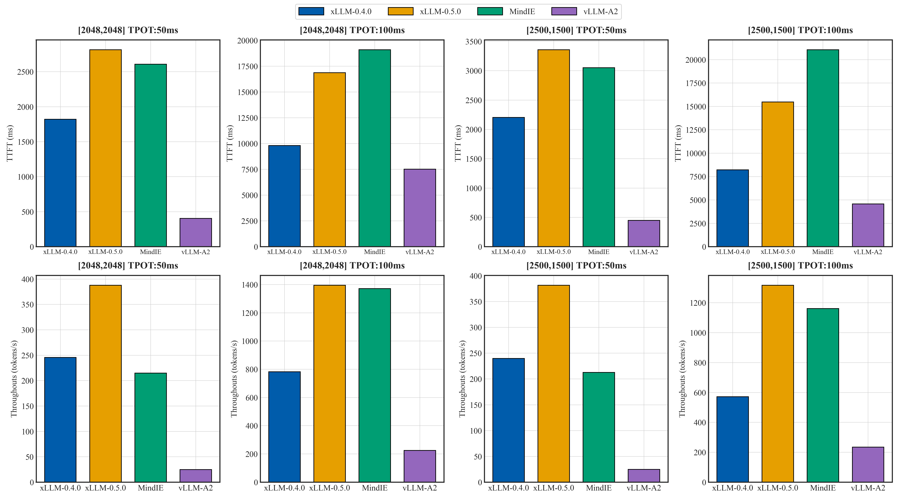
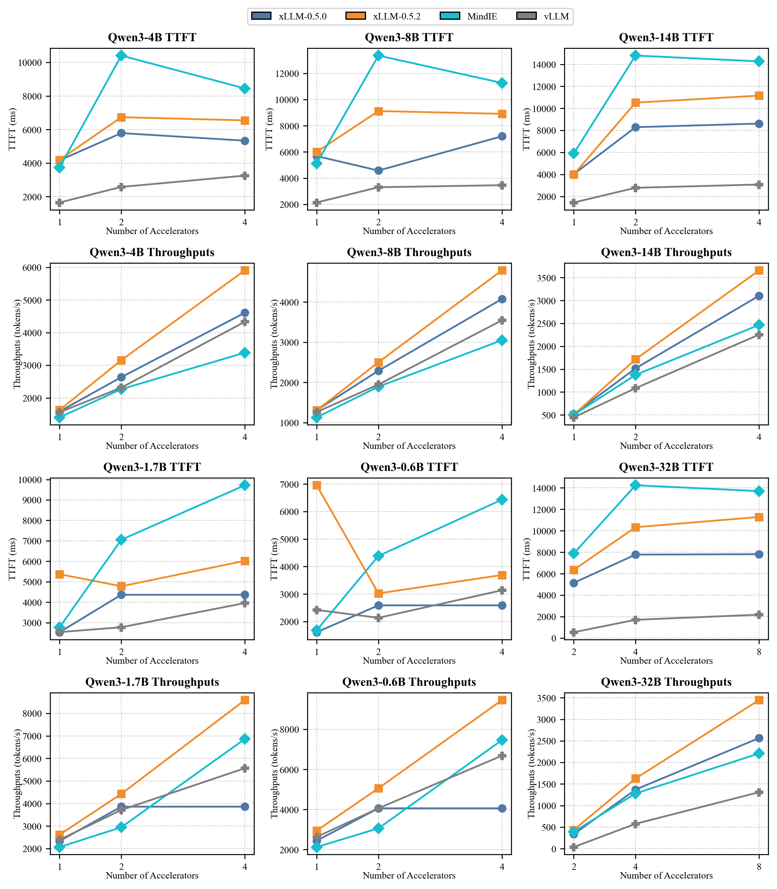

# 整体架构

近年来，随着百亿至万亿参数规模的大语言模型（如GPT、Claude、DeepSeek、LLaMA等）在自然语言处理和多模态交互领域取得突破性进展，产业界对高效推理引擎与服务体系的构建提出了迫切需求。如何降低集群推理成本、提升推理效率已成为实现规模化商业落地的关键挑战。

尽管当前已涌现出一批面向大模型推理的优化引擎，但在实际部署过程中仍面临诸多技术瓶颈：

- 硬件适配性挑战：现有推理引擎对国产芯片等专用加速器的架构特性支持不足，难以充分发挥异构计算硬件的性能潜力，导致计算资源利用率低下；
- MoE架构优化难题：专家并行机制中的令牌分发过程产生显著的All-to-All通信开销，同时动态路由策略引发的专家负载不均衡问题严重制约了系统的可扩展性；
- 长上下文管理瓶颈：随着模型上下文窗口持续扩展，KV缓存在内存碎片化处理、跨节点同步等方面的优化效率直接影响整体推理吞吐性能；
- 混合部署效能局限：现有推理集群在同时处理在线服务和离线任务时，难以兼顾服务质量（SLO）保障与资源利用率优化。
- 动态PD适配不足：当输入/输出序列长度出现剧烈波动时，静态PD资源划分缺乏实时调整PD资源配置的能力，既可能导致GPU资源闲置，又存在SLO违约风险。

为此，我们提出了xLLM——高效且易用的开源智能推理框架，为模型在国产芯片上的推理提供企业级服务保障与高性能引擎计算能力。
## 功能介绍

xLLM提供智能计算能力，我们实现了多种计算系统层和算法驱动层的联合推理加速：

### 计算系统层

#### 多层流水线执行编排
在框架层异步化CPU调度，使其与芯片推理计算形成流水线，减少计算空泡；在模型图层，切分单个batch，形成两个micro-batches之间的流水线，重叠计算通信；在算子内核层，不同计算单元间流水，重叠计算访存。
#### 动态shape的图执行优化
针对大语言模型处理动态输入（如可变序列长度和批大小）时面临的静态图适配问题，xLLM通过参数化设计捕获输入维度实现动态适配，并结合多图缓存方案减小编译开销，使用受管控的显存池替代绝对地址保障安全复用，最终在保持高灵活性的同时获得较高的执行效率。
#### 算子优化
xLLM实现了LLM中的关键算子在国产硬件芯片上的特定优化，包括GroupMatmul、Chunked Prefill等。
#### xTensor显存管理
xTensor 显存管理框架采用 物理内存页池预分配 + 虚拟地址连续性映射 的方法，通过动态按需映射物理页、复用可重用内存页（Reusable）及异步预映射优化调度，结合 NPU 算子适配（如虚拟地址化 FlashMLA），实现了高效动态内存管理，取得了内存利用率提升以及延迟降低。

### 算法驱动层

#### PD分离
xLLM全面支持PD分离场景，实现了高效的PD实例的管理以及PD实例之间的通信以及kv cache传输。

#### 全局调度
xLLM对请求和实例做全周期的资源调度智能管理。
##### 实例调度
我们实现了多种实例调度策略来选择如何将实例分配到更适合的实例。包括简单的Round Robin策略，基于请求在各实例上的prefix cache命中率来选择的prefix cahce-aware策略，基于实例上的显存空闲程度的kv cache-aware策略。另外，针对PD分离场景，由于静态的PD比例往往无法很好应对流量以及请求输入输出长度突变的场景，我们实现了一种自适应的PD动态调度器，负责在线请求的全局实例分配与运行时PD动态调整。
##### 请求调度
我们实现了多种请求调度策略，支持continuous batching，包括chunked prefill，prefill优先和decode优先等batch策略，同时全面支持PD分离场景。
#### 全局kv cache管理
在全局层面采用ETCD作为元数据服务中间件，实现集群服务注册、负载信息同步及全局缓存状态管理。每个计算实例维护本地多级缓存池。在调度策略方面，系统采用基于kv cache缓存的动态决策机制：首先进行前缀匹配检测，计算各候选节点的KV缓存复用率，最终选择综合性能最优的节点进行处理，实现kv cache的动态卸载与迁移。

#### 投机推理
xLLM内置优化后的投机推理算法，一次生成多个tokens提升吞吐。xLLM通过投机模块下沉减少通信成本，并使用调度和计算时序重叠优化、减少投机场景算子数据搬运等方式优化投机推理计算。
####  MOE负载均衡
xLLM针对MoE模型实现了基于历史专家负载统计的专家权重更新，在推理时通过高效专家负责统计和双缓冲无感知的专家权重更新实现有效的动态负载均衡。

### 多模态支持

xLLM对包括Qwen2-VL，MiniCPMV在内的多种多模态模型提供全面的支持。

## 性能效果

上图展示了不同推理框架在benchmark下对DeepSeek-R1-w8a8模型的吞吐量比较。在不同的提示长度与输出长度组合（[2048,2048]和[2500,1500]）以及TPOT（50ms和100ms）设置下，xLLM始终表现出最高的吞吐量。具体来说，在不同实验设置条件下，xLLM相比vLLM的 **吞吐量增长5.6倍至15.7倍**。

上图展示了不同推理框架在benchmark下，针对Qwen3模型各版本的吞吐量对比。图中的输入和输出长度均设为2048，TOPT为50ms。从结果可以看出，无论是对于Qwen3模型的不同版本，还是随着加速卡数量的变化，xLLM始终表现出最优的吞吐量。具体来说，xLLM相对于vLLM，其平均性能 **提升幅度可达到27%-186%**。